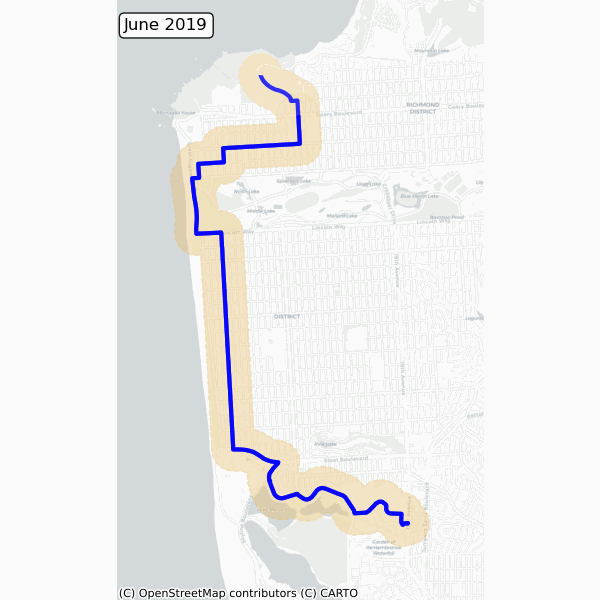
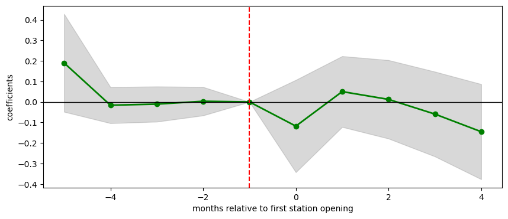

# How does the expansion of Bay Wheels affect bus ridership in San Francisco?

I investigate the causal effect of the Bay Wheels network expansion on SFMTA (Muni) bus ridership. **I find that adding one more bikeshare station within 400 meters of a bus route is associated with a 1.47% increase in average daily bus ridership on that route.** My result is consistent with the idea that Bay Wheels stations act as a complement, rather than a substitute, to Muni buses. 

### Methods
To identify the bikeshare stations within 400 meters of a bus route, I defined treatment zones using 400 meter buffers around the route's stops. Using GTFS shapefiles and Bay Wheels station coordinates, I tracked when that route saw a bikeshare station open within its treatment zones.

  
   
  
  <em>A visualization of how I defined the treatment. The blue line is the bus route (the 18 bus). The orange shaded areas are the treatment zones. A green dot is a     bikeshare station within the treatment zone.</em> 
  

 

I used a two way fixed effects model to estimate the causal effect, controlling for route and year-month fixed effects. This approached allowed me to isolate the effect of the Bay Wheels expansion by controlling for unobserved heterogeneity between routes (e.g., the 8 Bayshore is naturally busier than the 54 Felton because of their set routes) and time related shocks (e.g., COVID 19). 

### Event Study
To support my result, I use an event study to test for parallel pre trends. The result showed that the pre treatment coefficients are statistically insignificant. In other words, the treated and control routes have similar trends before Bay Wheels stations appeared.

  
   
  <em></em>

# Data 
- [Baywheels](https://www.lyft.com/bikes/bay-wheels/system-data) (download all csv files up to August 2025 (including) and place into `data/raw/`)
- [SFMTA (monthly average weekday ridership)](https://www.sfmta.com/reports/average-daily-muni-boardings-route-and-month-pre-pandemic-present) (throw into `data/raw/`)
- [SFMTA (stops/trips/routes/shapes)](https://www.sfmta.com/reports/gtfs-transit-data) (unzip into `data/raw/`)
