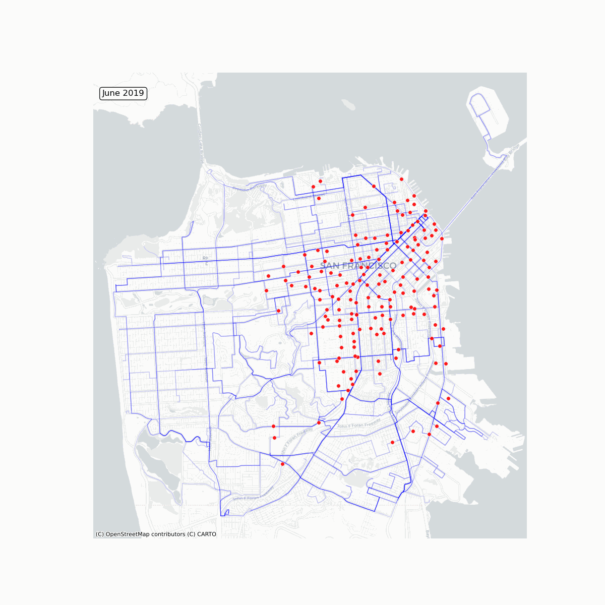

# Does the expansion of Bay Wheels bikeshare stations affect San Francisco Muni's average daily bus ridership? 

I investigate whether the expansion of the Bay Wheels bikeshare network acts as a substitute or a complement to SFMTA bus ridership. Using geospatial mapping and a Difference in Differences framework, I analyze monthly average ridership trends from January 2019 to August 2025.

*Animation showing the growth of Bay Wheels stations (red) and the bus routes (blue) from 2019 to 2025. Note, by the end of 2019 there were already 206 Bay Wheels stations in San Francisco*

**I find that adding one more bikeshare station within 400 meters of a bus route is associated with a 1.47 percent increase in average daily bus ridership on that route.** Put in another way, my result is consistent with the idea that Bay Wheels stations act as a complement, rather than a substitute, to Muni bus services.

### How did I define the treatment?
In short, I checked if a bus route passed near a bikeshare station that was active during that specific month. A bus route has many bus stops. So for each bus route, I applied a 400 meter buffer around each of its stops to identify which Bay Wheels stations fell within those buffer zones and calculated the total number of _unique_ stations. Of those unique stations, I only counted the stations that were actually open during the month in question. The result is the number of bikeshare stations actually available to a rider at that specific month. 

